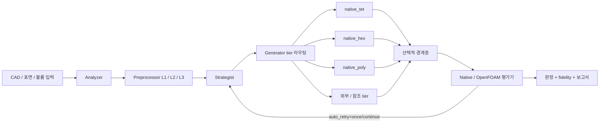

# AutoTessell LLM 위키

이 볼트는 AutoTessell의 코드와 연구 기록을 근거로 만든 지식 지도다. AutoTessell은 CAD 또는 표면 입력을 분석·정비한 뒤 native-first 메싱 엔진으로 OpenFOAM `polyMesh`를 생성하고, 품질을 평가해 CLI·데스크톱·웹으로 제공하는 플랫폼이다.

> [!important] 스냅샷의 의미
> 최초 문서는 **2026-07-26 작업트리**를 기준으로 작성했다. 이 작업트리에는 커밋된 코드와 대규모 미커밋 연구 WIP가 함께 있다. `working-tree`로 표시된 설명은 관찰된 구현이지 출시 계약이 아니다. 로드맵·문헌 계획·실측 결과는 서로 구분한다.

## 여기서 시작하기

- [[Architecture MOC|아키텍처 MOC]] — 파이프라인, 계약, 라우팅, 의존성 경계
- [[Engines MOC|엔진 MOC]] — 표면·tet·hex·poly·tri·quad·경계층 엔진
- [[Verification MOC|검증 MOC]] — 평가기, 영구 게이트, fidelity, 술어, 테스트
- [[Research MOC|연구 MOC]] — 문헌 원장, 구현 카드, 실측 상태
- [[자율 개선 로드맵과 남은 작업 2026-07-27|자율 개선 로드맵]] — 엔진별 현재 카드, 다음 순서, 중단 조건
- [[Repository Map|저장소 지도]] — 디렉터리별 책임
- [[Contradictions and Open Questions|문서 불일치와 열린 질문]] — 코드와 문서가 다른 곳
- [[index|전체 문서 색인]]

## 한눈에 보는 시스템

일반적인 품질 개선보다 우선하는 최상위 원칙은 **볼륨 메싱이 pre-meshing 표면을 바꾸지 않는 것**이다. 자세한 내용은 [[Surface Preservation Invariant|표면 보존 불변식]]에 있다.

## 위키 유지 방식

이 볼트는 Karpathy의 LLM Wiki 모델을 따른다. 저장소 코드·테스트·연구 노트는 원본 소스이고, 이 볼트는 LLM이 관리하는 누적 합성 계층이다. [[Wiki Maintenance Contract|위키 유지보수 계약]]이 ingest·query·lint 규칙을 정하며, 중요한 갱신은 [[log|위키 작업 기록]]에 이어 쓴다.

설계 참고: [Karpathy의 “LLM Wiki”](https://gist.github.com/karpathy/442a6bf555914893e9891c11519de94f)
